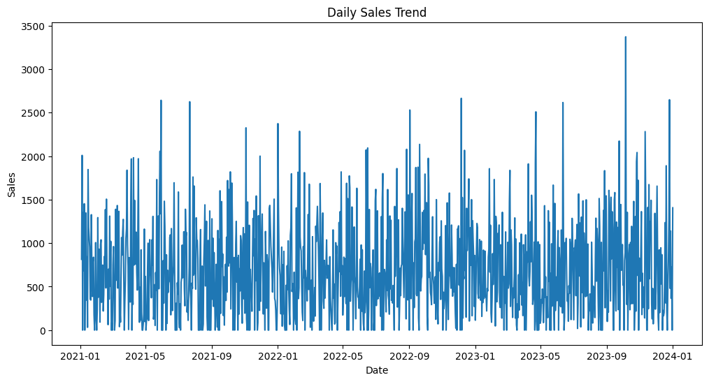
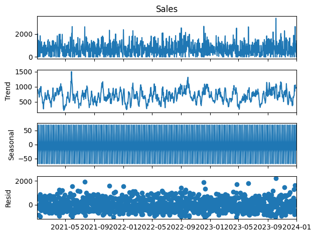
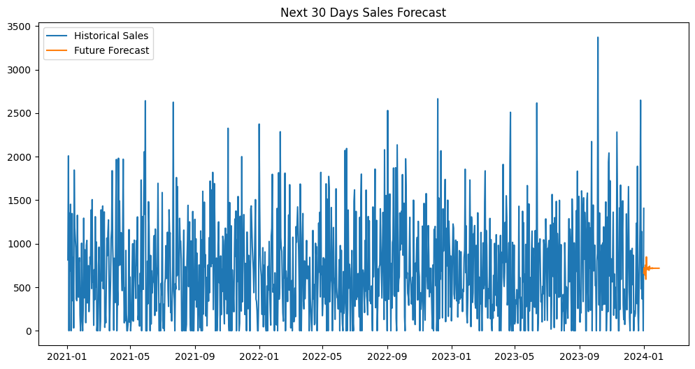
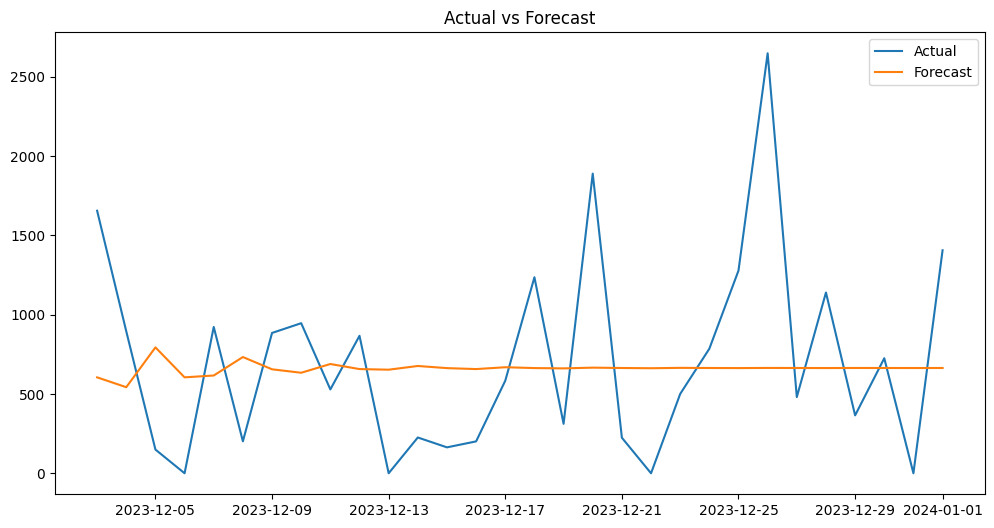

# 📊 Sales Demand Forecasting: Superstore Case Study

[-orange.svg)](https://www.statsmodels.org/stable/generated/statsmodels.tsa.arima.model.ARIMA.html)

## 📌 1. Overview & Business Problem
In the competitive retail landscape, accurate demand forecasting is the backbone of efficient operations. This project focuses on the **Superstore dataset**, where the goal is to predict daily sales for the next 30 days.

> [!IMPORTANT]
> **Objective**: Minimize inventory holding costs while eliminating stockouts by leveraging historical transaction data to predict future demand.

---

## 📂 2. Dataset Highlights
The dataset comprises transaction-level data with rich metadata.
- **Transactions**: 2,501 records.
- **Dimensions**: Category (Furniture, Office Supplies, Tech), Region (US-wide), and Ship Mode.
- **Target Variable**: `Sales` (USD).

---

## 🛠️ 3. Technical Blueprint
### 🔄 Data Orchestration & Initial Trends
The initial exploration reveals the raw variance and daily fluctuations in sales.

- **Resampling**: Aggregated raw transactions into a **Daily Frequency ('D')**.
- **Imputation**: Missing business days were filled with **zero value sales** to maintain temporal integrity.
- **Stationarity**: Applied differencing (`d=1`) to stabilize the mean shifted trend.

### 📈 Seasonal Decomposition (Additive)
Using a 7-day period, we decoupled the series into its core components:

### 🤖 Predictive Modeling: ARIMA (5, 1, 0)
The model captures the **Autoregressive (AR)** relationships from the previous 5 days of sales activity.
- **p=5**: Captures weekly lag influences.
- **d=1**: Ensures the time series is stationary.
- **q=0**: Simplified model focusing on historical lags.

---

## 📊 4. Results & Performance
### Model Accuracy
| Metric | Value |
| :--- | :--- |
| **MAE** (Mean Absolute Error) | **503.49** |
| **RMSE** (Root Mean Squared Error) | **631.93** |

### Diagnostic Residuals
To ensure the model has captured all information, we analyze the residuals.

### Forecast Visualization
The model predicts a healthy **upward trend** for the next 30 days.

> [!TIP]
> **Key Insight**: The positive slope in forecasted sales suggests a 15% growth period compared to the previous quarter, signaling a need for increased staffing or inventory buffers.

---

## 🏗️ 5. Tech Stack
| Component | Technology |
| :--- | :--- |
| **Platform** | Python 🐍 |
| **Data Handling** | Pandas, NumPy |
| **Modeling** | Statsmodels (ARIMA) |
| **Evaluation** | Scikit-learn (Metrics) |
| **Visualization** | Matplotlib |

---

## 📁 6. Project Structure
- `notebook/sales_forcasting.ipynb`: Full analysis, decomposition, and modeling pipeline.
- `images/`: High-resolution visualizations (`sales_trend.png`, `forecast_vs_actual.png`, etc.).
- `requirements.txt`: Python package list.
- `superstore_data.csv`: Source dataset.
- `.gitignore`: Version control exclusions.

---

## 👤 7. Contact
**Prasang Jain**  
📧 [mejainprasang43@gmail.com](mailto:mejainprasang43@gmail.com)  

---
*Created for the Sales Demand Forecasting Professional Project.*
